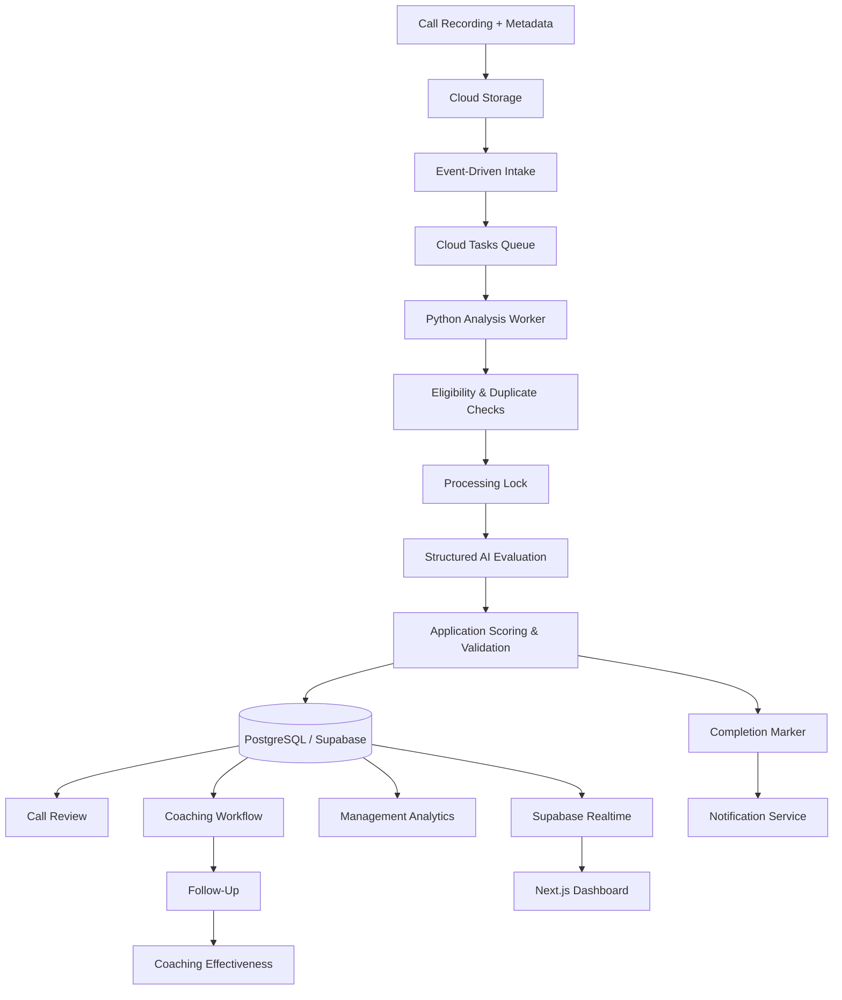

# AI Call Quality & Coaching Platform

An AI-powered quality assurance, coaching, and management analytics platform I designed and built to process customer service calls, generate structured QA evaluations, support one-on-one coaching, measure follow-up performance, and give leadership visibility into quality trends and operational health.

The platform combines event-driven cloud processing, AI-assisted analysis, deterministic scoring, PostgreSQL workflows, automated notifications, coaching management, and reporting in one system.

> The production application and source repository are maintained privately because they contain internal QA standards, employee workflows, proprietary business logic, infrastructure configuration, credentials, and operational integrations.

---

## Overview

The project started with a practical problem: reviewing customer service calls manually makes it difficult to evaluate enough interactions, keep scoring consistent, provide timely coaching, and give management useful visibility into what is happening across the organization.

I built the platform to turn that process into a structured workflow.

Completed call recordings move through an automated background-processing pipeline. The system validates the incoming call, checks whether it is eligible for analysis, prevents duplicate processing, performs structured AI-assisted evaluation, calculates the official QA result, stores the output, and routes the information into coaching and management workflows.

At a high level:

```text
Customer Service Call
        ↓
Call Recording + Metadata
        ↓
Cloud Storage
        ↓
Queue / Processing Layer
        ↓
Python Analysis Worker
        ↓
Structured AI Evaluation
        ↓
Application Scoring & Validation
        ↓
PostgreSQL / Supabase
      ↙          ↘
Coaching         Management
Workflow          Analytics
      ↓              ↓
Follow-Up        Reporting
      ↓
Effectiveness Measurement
```

The goal was not simply to automate call scoring.

The broader goal was to create a system that connects **QA, coaching, follow-up, analytics, and operational oversight**.

---

## What the Platform Handles

The platform includes workflows for:

- Automated call ingestion
- Background call processing
- AI-assisted QA analysis
- Structured QA category evaluation
- Deterministic scoring
- Call outcome and issue classification
- Duplicate-call protection
- Agent eligibility validation
- Processing locks and retry handling
- Coaching recommendations
- One-on-one coaching sessions
- Coaching scheduling
- Agent acknowledgment
- Follow-up tracking
- Coaching effectiveness measurement
- Representative performance reporting
- Management analytics
- QA trend reporting
- Automated coaching notifications
- Notification delivery tracking
- Processing-health monitoring
- Failure and exclusion tracking
- Role-based application access
- Versioned QA standards and rubric management
- Production / staging separation

---

## Technology

The platform includes work across:

- Python
- TypeScript
- React / Next.js
- PostgreSQL
- SQL / PL/pgSQL
- Supabase
- Supabase Realtime
- Google Cloud
- Cloud Storage
- Cloud Tasks
- Event-driven processing
- AI / LLM workflows
- Structured model output
- Serverless services
- Vercel
- REST APIs
- SMTP
- HTML / CSS
- Shell

---

## Core Architecture



The individual services are intentionally separated so ingestion, AI processing, persistence, notification delivery, coaching, and analytics do not depend on one tightly coupled process.

---

# Platform Showcase

The screenshots below highlight several parts of the platform, from automated QA processing through coaching workflows, management analytics, and system-health monitoring.

> Employee-identifying information, individual performance details, internal file identifiers, and sensitive operational data have been removed or obscured for this public portfolio.

---

## QA Overview

The QA Overview gives managers a high-level view of recent quality activity and workflow health.

It brings together analyzed call volume, aggregate QA performance, items requiring review, notification status, and recently processed calls in one interface.

**Highlights:**

- Recent QA activity
- Aggregate quality metrics
- Review workload
- Workflow status
- Call outcomes
- Notification tracking
- Live operational updates
- Production-state visibility


---

## Analyzed Calls

The Analyzed Calls interface provides a searchable and filterable view of completed call evaluations.

Each interaction can be reviewed by call type, issue, outcome, score, review status, and workflow state.

**Highlights:**

- Search and filtering
- Call classification
- Issue identification
- QA-score visibility
- Review status
- Coaching workflow indicators
- Production / staging separation
- Follow-up tracking


---

## Coaching Action Center

The Coaching Action Center turns QA results into a structured management workflow.

Supervisors can create coaching sessions, schedule one-on-one discussions, document follow-up activity, track open sessions, and connect the coaching record back to the source call.

**Highlights:**

- Coaching-session management
- Open and scheduled sessions
- Supervisor assignment
- Follow-up due dates
- Discussion tracking
- Source-call linkage
- Session status tracking
- Search and filtering
- Coaching history


---

## Coaching Effectiveness

The Coaching Effectiveness view measures whether documented coaching is followed by measurable changes in QA performance.

The platform compares scored calls before and after coaching and surfaces overall and category-level changes.

**Highlights:**

- Before-and-after QA comparison
- Configurable comparison windows
- Coaching outcome measurement
- Category-level performance signals
- Follow-up completion
- Representative improvement tracking
- Minimum sample-size handling
- Measurable coaching impact


---

## Management Analytics

The Management Analytics dashboard gives leadership a broader view of QA performance across the customer service organization.

It combines executive KPIs, score trends, representative comparisons, review completion, call outcomes, and other performance signals into one reporting interface.

**Highlights:**

- Executive QA KPIs
- QA-score trends
- Performance benchmarking
- Representative comparisons
- Review completion
- Outcome reporting
- Follow-up rates
- Management-level visibility


---

## Processing Health

The Processing Health interface provides operational visibility into the automated analysis pipeline.

Administrators can see received inputs, completed analysis, excluded calls, duplicate handling, processing attempts, notification outcomes, and failures.

**Highlights:**

- Input-volume monitoring
- Analysis-completion tracking
- Excluded-call handling
- Duplicate detection
- Eligibility checks
- Processing attempts
- Failure monitoring
- Notification state
- Administrative troubleshooting


---

# How the Processing Pipeline Works

A completed recording enters an asynchronous processing pipeline rather than being analyzed inside the user-facing application.

```text
Call Recording
      ↓
Cloud Storage
      ↓
Storage Event
      ↓
Intake Validation
      ↓
Deterministic Cloud Task
      ↓
Analysis Worker
      ↓
Duplicate / Eligibility Check
      ↓
Processing Lock
      ↓
Structured AI Analysis
      ↓
Application Scoring
      ↓
Persist QA Result
      ↓
Publish Completion Marker
      ↓
Coaching Notification
```

This separation allows long-running AI workloads to operate independently from the dashboard and gives the platform better control over retries, duplicate events, failures, and processing volume.

---

# Selected Engineering Challenges

A large part of the work on this platform involved building the systems around the AI model.

---

## Burst Call Processing

Call recordings do not necessarily arrive at a steady rate.

Instead of sending each incoming recording directly to an analysis worker, the system places work into a controlled queue.

```text
Incoming Recordings
        ↓
Cloud Storage
        ↓
Cloud Tasks
        ↓
Controlled Worker Processing
```

This creates a buffer between call arrival volume and AI-processing capacity.

---

## Duplicate Processing Protection

Cloud events and queued workloads can be delivered more than once.

The processing system uses multiple safeguards so a repeated event does not automatically generate another AI request for the same interaction.

These include:

- Deterministic task identifiers
- Existing-call checks
- Atomic processing locks
- Durable processing state

```text
Queued Call
    ↓
Already Processed?
   /            \
 Yes             No
  ↓               ↓
Skip        Acquire Lock
                  ↓
              Analyze
```

This is important both for data integrity and AI-processing cost.

---

## Eligibility Before AI Spend

The application validates whether a call should be processed before sending it to the model.

Representative identity comes from authoritative system data rather than relying on the AI model to determine who handled the interaction.

```text
Call Metadata
      ↓
Representative Identifier
      ↓
Application Lookup
      ↓
Active / Eligible?
   /             \
 No               Yes
 ↓                 ↓
Skip          AI Analysis
```

This avoids unnecessary model calls and keeps employee identity under application control.

---

## Structured AI Output

The platform does not rely on free-form AI text as the primary operational record.

The model returns structured fields that can be validated before being persisted.

Conceptually:

```text
Audio Recording
      ↓
AI Evaluation
      ↓
Structured Response
   ├── Summary
   ├── Eligibility
   ├── Category Scores
   ├── Strengths
   ├── Coaching Opportunities
   └── Supporting Evidence
```

Structured output allows the same analysis to support:

- QA scoring
- Management reporting
- Coaching recommendations
- Category analysis
- Follow-up
- Trend reporting
- Effectiveness measurement

---

## Deterministic Scoring

One of the important design decisions was keeping the official aggregate score outside the AI model.

The model evaluates categories and returns structured results.

Application code applies the official weighting and scoring rules.

```text
AI Category Evaluation
        ↓
Structured Scores
        ↓
Application Weighting
        ↓
Official QA Score
```

This keeps the final scoring system repeatable, testable, and versionable independently of model behavior.

---

## Persistence Before Notification

A coaching notification should never be sent for a QA result that was not successfully stored.

The system therefore persists the analysis before publishing the notification-ready event.

```text
AI Analysis
      ↓
Validate Result
      ↓
Persist QA Record
      ↓
Success?
   /        \
 No          Yes
 ↓            ↓
Retry      Completion Marker
                 ↓
           Notification
```

This prevents downstream workflow from getting ahead of the underlying data.

---

## Duplicate-Safe Coaching Notifications

Event-driven notification systems also need duplicate protection.

Before contacting the mail server, the notification service reserves a durable notification state.

```text
Completion Event
      ↓
Acquire Notification Lock
      ↓
Already Reserved?
   /             \
 Yes              No
  ↓                ↓
Skip            Send
                  ↓
             Save Receipt
```

This protects representatives from receiving duplicate coaching emails when cloud events are retried.

---

## Coaching Workflow Enforcement

The coaching process is modeled as a real lifecycle rather than an unrestricted status field.

A simplified workflow is:

```text
Draft
  ↓
Scheduled
  ↓
Held
  ↓
Acknowledged
  ↓
Follow-Up Due
  ↓
Closed
```

PostgreSQL validates allowed transitions and records lifecycle events.

That means important workflow rules remain enforced even if a request bypasses front-end validation.

---

## Coaching Effectiveness

The platform does not stop at documenting that coaching occurred.

It also measures what happens afterward.

```text
Calls Before Coaching
        ↓
Baseline Performance
        ↓
Coaching Session
        ↓
Calls After Coaching
        ↓
Post-Coaching Performance
        ↓
Comparison
```

The reporting logic can measure:

- Overall QA-score change
- Category-level change
- Minimum sample requirements
- Improvement / stable / decline signals
- Follow-up completion

Later coaching sessions are also accounted for so performance from a newer intervention is not incorrectly attributed to an older session.

---

## Realtime Dashboard Updates

Background workers may continue changing a call after the initial analysis is written.

The dashboard subscribes to database changes through Supabase Realtime and refreshes when relevant records change.

Closely spaced events are debounced so a single call moving through several processing states does not trigger unnecessary repeated refreshes.

---

# Implementation Examples

The full production application remains private, but this repository includes sanitized examples based on selected implementation patterns from the platform.

These examples show how I approached cloud ingestion, queueing, AI analysis, duplicate protection, database workflow enforcement, effectiveness analytics, and Realtime application behavior.

---

## Cloud Task Intake

**[View `cloud-task-intake.py` →](examples/cloud-task-intake.py)**

Shows how finalized recordings are validated and converted into deterministic Google Cloud Tasks.

**Demonstrates:**

- Cloud Storage events
- Companion metadata validation
- Object-generation tracking
- Deterministic task IDs
- Event deduplication
- OIDC authentication
- Queue-based buffering

---

## Structured QA Worker

**[View `structured-qa-worker.py` →](examples/structured-qa-worker.py)**

Shows the core analysis-worker pattern.

**Demonstrates:**

- Eligibility checks before model use
- Duplicate protection
- Atomic processing locks
- Structured AI responses
- Schema validation
- Deterministic application scoring
- Checkpoint-oriented retries
- Persistence-before-notification ordering
- AI / application responsibility separation

---

## Duplicate-Safe Coaching Notification

**[View `duplicate-safe-coaching-notifier.py` →](examples/duplicate-safe-coaching-notifier.py)**

Shows how notification delivery is protected against repeated event delivery.

**Demonstrates:**

- Event-driven notifications
- Durable idempotency locks
- Duplicate-send prevention
- SMTP
- Sent / skipped / failed states
- Notification receipts
- Retry handling

---

## Coaching Lifecycle

**[View `coaching-lifecycle.sql` →](examples/coaching-lifecycle.sql)**

Shows PostgreSQL-enforced coaching-session workflow rules.

**Demonstrates:**

- State-machine design
- Controlled transitions
- Immutable source identity
- Required workflow fields
- Agent acknowledgment
- Trigger-based audit history
- Row Level Security

---

## Coaching Effectiveness

**[View `coaching-effectiveness.sql` →](examples/coaching-effectiveness.sql)**

Shows the SQL used conceptually to measure performance before and after coaching.

**Demonstrates:**

- Pre/post comparison windows
- SQL filtered aggregates
- Score deltas
- Category-level deltas
- Minimum sample requirements
- Overlapping coaching-period protection

---

## Realtime Call Updates

**[View `realtime-call-updates.tsx` →](examples/realtime-call-updates.tsx)**

Shows the dashboard subscription pattern used as background processing updates QA records.

**Demonstrates:**

- React / Next.js
- Supabase Realtime
- PostgreSQL subscriptions
- Environment-scoped events
- Debounced refreshes
- Connection-state handling

---

### More About the Examples

**[View the Implementation Examples README →](examples/README.md)**

The examples README explains how these samples relate to the larger processing and coaching architecture.

---

# Technical Documentation

For a deeper look at the system:

- **[System Architecture →](docs/architecture.md)**  
  Processing pipeline, cloud services, application layers, data flow, queues, workers, notifications, role-based access, and end-to-end system design.

- **[Technical Overview →](docs/technical-overview.md)**  
  Implementation details covering Python workers, AI analysis, structured outputs, PostgreSQL, task queues, duplicate prevention, reporting, testing, reliability, and deployment.

- **[Implementation Examples →](examples/README.md)**  
  Sanitized examples covering Cloud Tasks intake, structured AI analysis, duplicate-safe notifications, coaching lifecycle enforcement, effectiveness analytics, and Realtime dashboard updates.

---

# My Role

I designed and developed the platform from the original business requirements through production implementation, deployment, and ongoing feature development.

My work included:

- Identifying and mapping the QA and coaching workflow
- Application architecture
- AI-processing architecture
- Python worker development
- TypeScript / Next.js dashboard development
- PostgreSQL database architecture
- SQL and PL/pgSQL development
- Google Cloud integration
- Cloud Storage event processing
- Cloud Tasks queueing
- Structured AI-output design
- Scoring workflow design
- Duplicate-prevention logic
- Processing locks and retry handling
- Coaching workflow design
- Database-enforced coaching lifecycles
- Coaching-effectiveness measurement
- Management analytics
- Representative performance reporting
- Notification automation
- Notification idempotency
- Processing-health monitoring
- Role-based access
- Realtime dashboard updates
- Testing
- Deployment
- Production troubleshooting
- Ongoing feature development and support

The project required work across both the operational and technical sides of customer-service quality management: understanding how calls should be evaluated, how coaching should be handled by supervisors, what leadership needs to see, and how those processes can be supported reliably through software and AI.

---

# Source Code & Production Data

The complete production repository remains private because it contains:

- Internal QA standards and rubrics
- Employee information
- Coaching records
- Company-specific workflow rules
- Production database schemas
- Cloud infrastructure configuration
- Credentials and secrets
- Internal service identifiers
- Notification configuration
- Production integrations
- Proprietary scoring and operational logic

This public repository is a sanitized portfolio representation of the platform.

The screenshots, technical documentation, architecture, and implementation examples are intended to show what I built, the problems it solves, and the engineering decisions behind it without exposing the production environment.

---

## Summary

The platform connects the full QA and coaching workflow:

```text
Customer Service Call
        ↓
Automated Processing
        ↓
AI-Assisted Evaluation
        ↓
Structured QA Result
        ↓
Management Review
        ↓
Coaching
        ↓
Follow-Up
        ↓
Effectiveness Measurement
        ↓
Reporting & Analytics
```

What started as a call-review problem grew into a broader quality-management system connecting automated analysis, structured QA, human coaching, follow-up, analytics, and operational monitoring in one platform.
