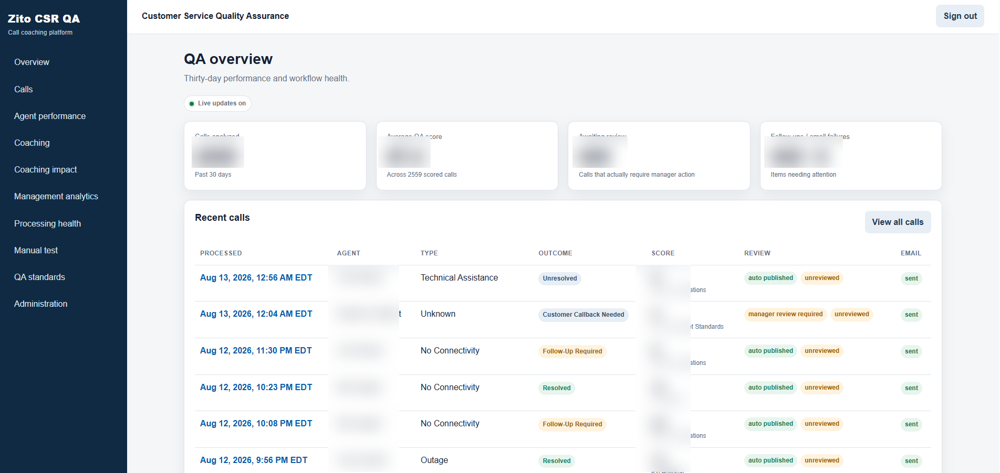
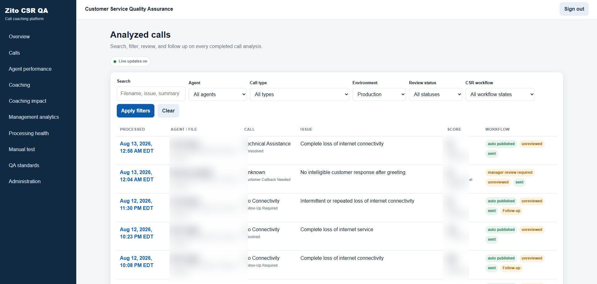
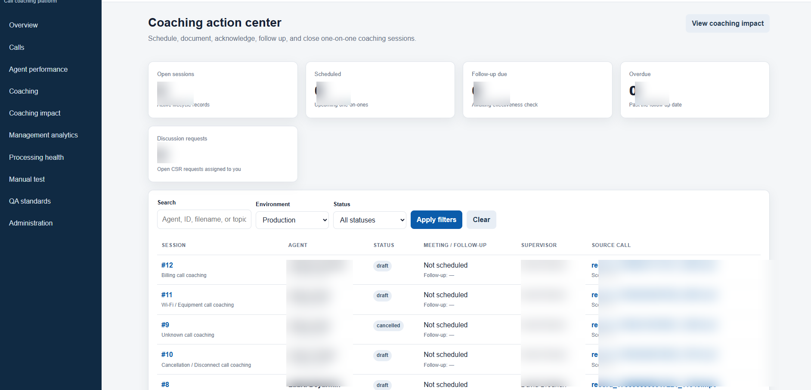
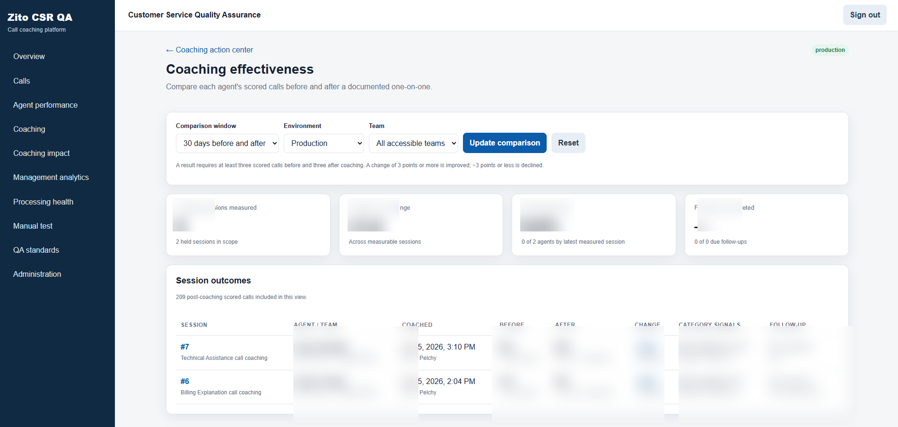
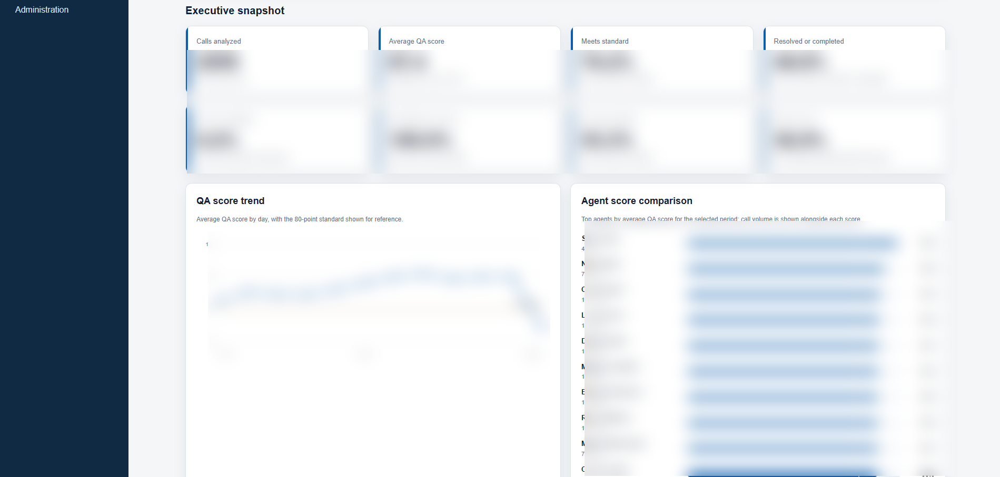
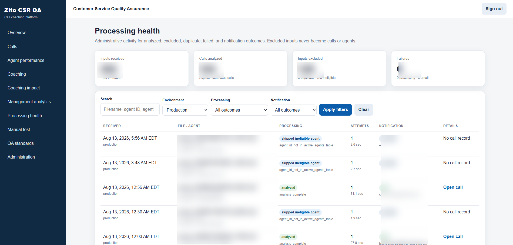

# AI Call Quality & Coaching Platform

An AI-powered quality assurance and coaching platform designed to analyze customer service calls, generate structured QA evaluations, support one-on-one coaching, and provide management with visibility into performance and operational trends.

> Production source code is maintained privately because the application contains proprietary business logic, internal infrastructure, company-specific QA standards, and operational integrations.

## Overview

The platform was built to make call quality assurance more consistent, scalable, and transparent.

Instead of relying only on manual call reviews, the system processes completed calls through an automated analysis workflow, generates structured QA results, identifies coaching opportunities, tracks follow-up actions, and provides reporting for representatives, supervisors, and management.

The platform combines call analysis, quality scoring, coaching workflows, performance reporting, notification tracking, and processing health into a single system.

## Key Features

- Automated call ingestion and analysis
- AI-assisted quality assurance scoring
- Structured QA category evaluation
- Call outcome and issue classification
- Coaching recommendations
- One-on-one coaching workflow management
- Coaching effectiveness measurement
- Representative performance tracking
- Management analytics and trend reporting
- Automated coaching notifications
- Follow-up and review workflows
- Processing health and failure monitoring
- Duplicate and ineligible-call handling
- Role-based application access
- Versioned QA standards and rubric management

## Technology

- Python
- TypeScript
- PostgreSQL
- PL/pgSQL
- Supabase
- Google Cloud
- Vercel
- AI / LLM Workflows
- Task Queues
- REST APIs
- SQL
- HTML / CSS
- Shell

---

## Platform Showcase

The screenshots below highlight the major parts of the platform, from automated QA processing and call review to coaching workflows, management analytics, and system health monitoring.

> Employee-identifying information, individual performance details, internal file identifiers, and sensitive operational data have been removed or obscured for this public portfolio.

### QA Overview

The QA Overview provides a high-level view of recent quality assurance activity and workflow health.

Managers can quickly review analyzed call volume, aggregate QA performance, items requiring review, notification status, and recently processed calls from a single interface.

**Highlights:**

- Recent QA activity
- Aggregate quality metrics
- Review workload visibility
- Workflow status
- Call outcomes
- Notification tracking
- Live operational updates



---

### Analyzed Calls

The Analyzed Calls interface provides a searchable and filterable view of completed call evaluations.

Each analyzed interaction can be reviewed by call type, issue, outcome, score, review status, and workflow state.

**Highlights:**

- Search and filtering
- Call classification
- Issue identification
- QA score visibility
- Review status
- Coaching workflow indicators
- Production/staging separation
- Follow-up tracking



---

### Coaching Action Center

The Coaching Action Center turns QA results into a structured management workflow.

Supervisors can create and track coaching sessions, schedule one-on-one discussions, document follow-up activity, monitor open sessions, and connect coaching back to the source call.

**Highlights:**

- Coaching session management
- Open and scheduled session tracking
- Supervisor assignment
- Follow-up due dates
- Discussion requests
- Source-call linkage
- Session status tracking
- Search and filtering



---

### Coaching Effectiveness

The Coaching Effectiveness view measures whether documented coaching is followed by measurable changes in QA performance.

The platform compares scored calls before and after coaching sessions and surfaces category-level signals to help determine whether performance improved, remained stable, or declined.

**Highlights:**

- Before-and-after QA comparison
- Configurable comparison windows
- Coaching outcome measurement
- Category-level performance signals
- Follow-up completion
- Agent improvement tracking
- Measurable coaching impact



---

### Management Analytics

The Management Analytics dashboard provides leadership with a broader view of QA performance across the customer service organization.

It combines executive KPIs, score trends, representative comparisons, review completion, call outcomes, and other performance signals into a single reporting interface.

**Highlights:**

- Executive QA KPIs
- QA score trends
- Performance benchmarking
- Representative comparisons
- Review completion
- Outcome reporting
- Follow-up rates
- Management-level visibility



---

### Processing Health

The Processing Health interface provides operational visibility into the automated call-analysis pipeline.

Administrators can see received inputs, successfully analyzed calls, excluded inputs, processing failures, notification outcomes, processing attempts, and detailed workflow states.

**Highlights:**

- Input volume monitoring
- Analysis completion tracking
- Excluded-call handling
- Duplicate and eligibility checks
- Processing attempt visibility
- Failure monitoring
- Notification status
- Administrative troubleshooting



---

## How the Platform Works

At a high level, the system moves completed call recordings through an asynchronous processing and analysis pipeline.

```text
Customer Service Call
        ↓
Call Recording / Intake
        ↓
Cloud Storage
        ↓
Processing Queue
        ↓
Python Analysis Worker
        ↓
AI / LLM Evaluation
        ↓
Structured QA Result
        ↓
PostgreSQL / Supabase
      ↙          ↘
CSR / Coaching    Management
   Workflows       Analytics
      ↓               ↓
Notifications     Reporting
```

The processing architecture is designed so call ingestion, AI analysis, database persistence, coaching notifications, and management reporting are separate responsibilities rather than one tightly coupled process.

## Core Technical Concepts

### Asynchronous Processing

Call analysis is handled outside the user-facing application so long-running AI workloads do not block the dashboard or require users to wait for processing to finish.

### Structured AI Output

AI analysis is transformed into structured records rather than stored only as free-form text.

This allows the platform to use QA results for:

- Scoring
- Reporting
- Coaching recommendations
- Category comparisons
- Follow-up workflows
- Management analytics

### Queue-Based Workloads

Calls enter a controlled processing queue before analysis.

This provides a buffer between incoming recordings and analysis workers and allows the system to manage workload independently from call arrival volume.

### Processing Resilience

The system tracks processing state so calls can be distinguished between:

- Successfully analyzed
- Excluded
- Ineligible
- Duplicate
- Failed
- Pending
- Notification complete

This makes the processing pipeline observable rather than treating failures as invisible background events.

### Coaching Workflow Separation

Automated QA results do not replace supervisor coaching.

Instead, the system uses analyzed call data to support structured human coaching workflows, documentation, follow-up, and effectiveness measurement.

---

## Technical Documentation

For a deeper look at the system:

- **[System Architecture →](docs/architecture.md)**  
  Processing pipeline, cloud services, application layers, data flow, queues, workers, notifications, role-based access, and end-to-end system design.

- **[Technical Overview →](docs/technical-overview.md)**  
  Implementation details covering Python workers, AI analysis, structured outputs, PostgreSQL, task queues, duplicate prevention, reporting, testing, reliability, and deployment.

---

## My Role

I designed and developed the platform from the business requirements through production implementation and ongoing feature development.

My work included:

- Application and workflow design
- AI analysis workflow design
- Python processing services
- TypeScript dashboard development
- Database architecture
- SQL and PL/pgSQL development
- Queue and worker workflows
- Structured QA result handling
- Coaching workflow design
- Management analytics
- Notification automation
- Processing health monitoring
- Error handling and retry logic
- Duplicate-prevention workflows
- Role-based reporting
- Testing
- Deployment
- Production troubleshooting and support

## Source Code

The production repository is private because it contains proprietary company workflows, internal QA standards, infrastructure configuration, integrations, and operational logic.

This public repository is provided as a portfolio overview of the system, the problems it solves, and the technical work involved in designing and developing it.
