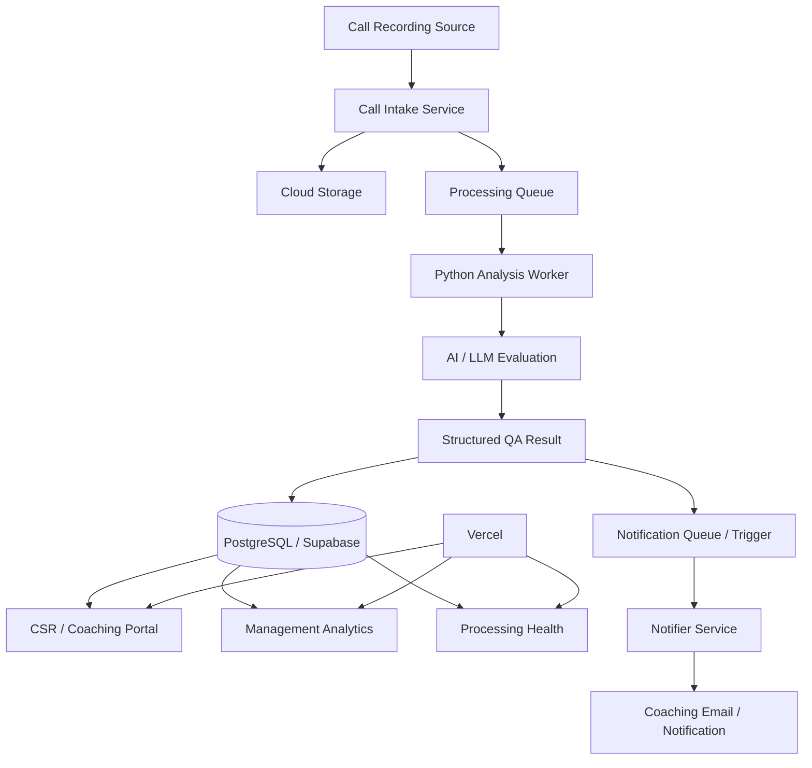
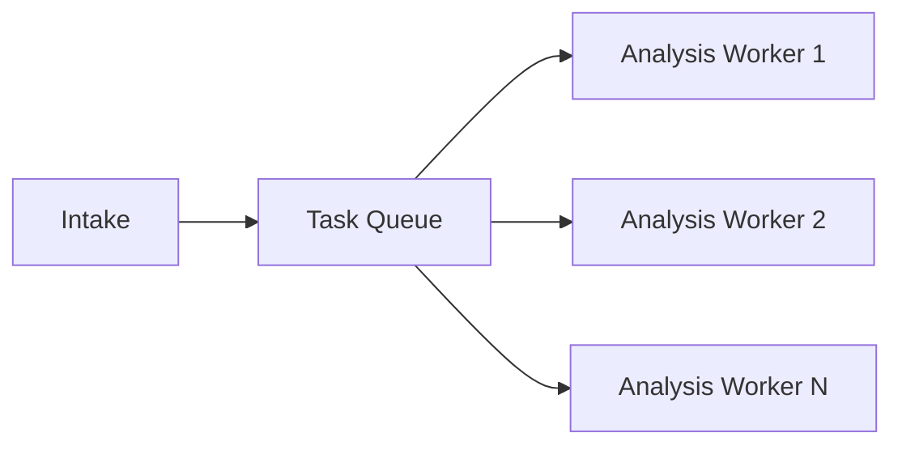
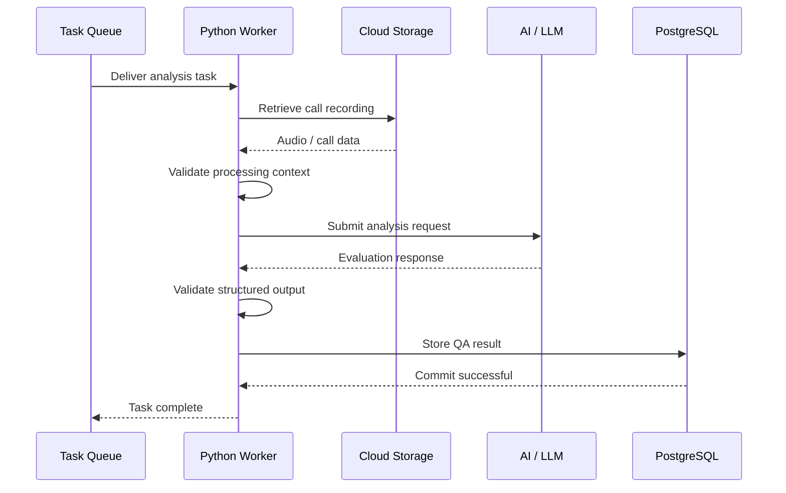
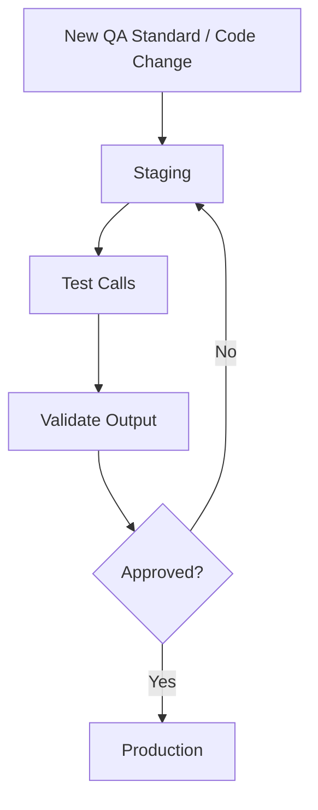
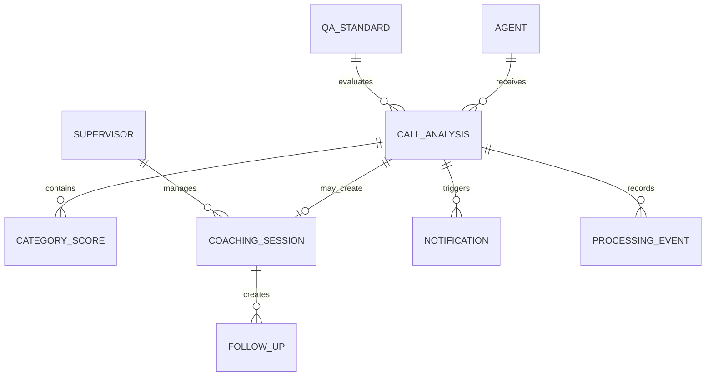
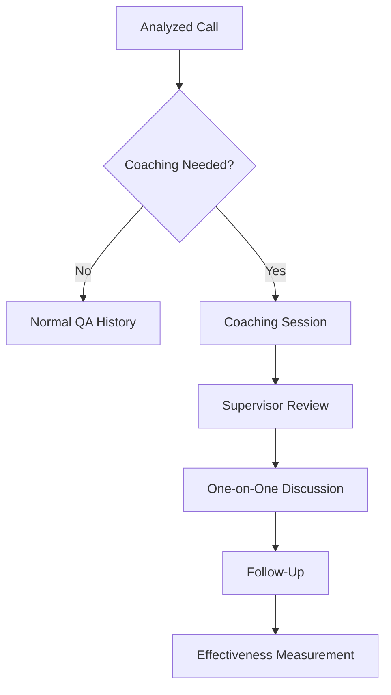
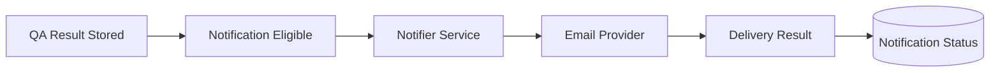
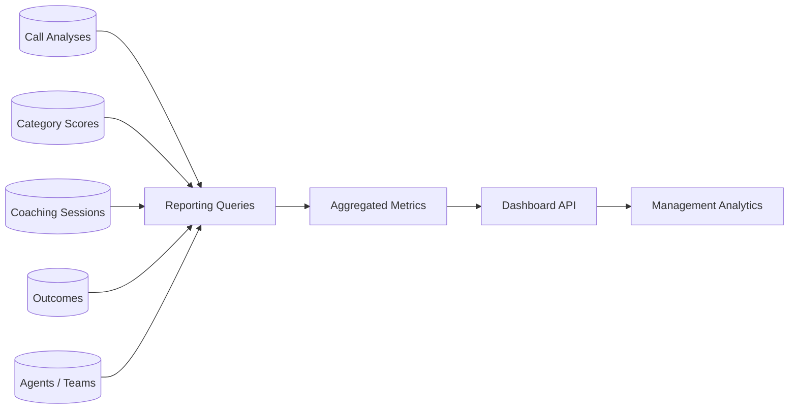
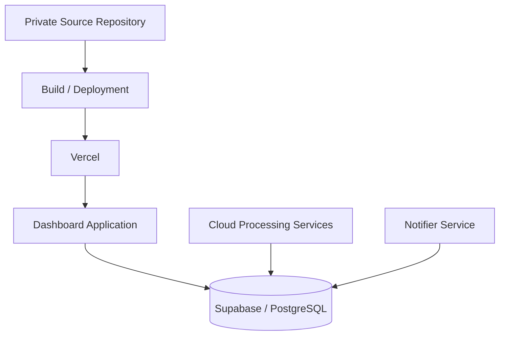
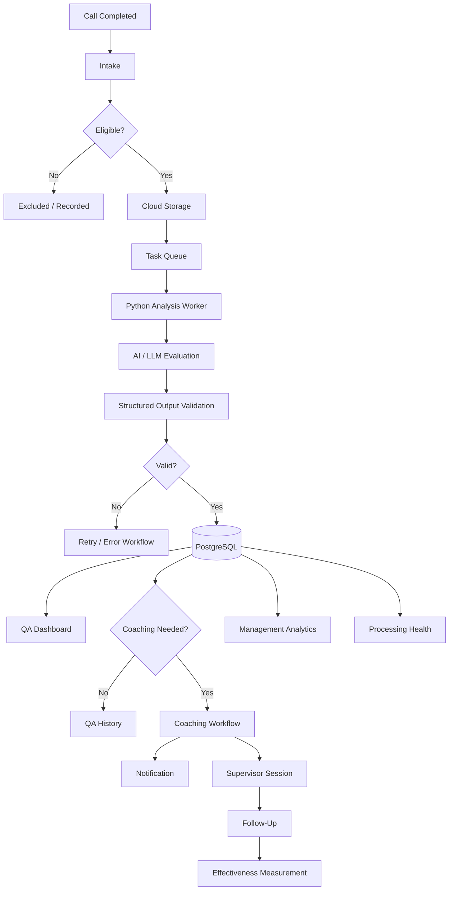

# AI Call Quality & Coaching Platform — System Architecture

## Purpose

The platform is a cloud-based quality assurance and coaching system designed to process customer service calls, generate structured AI-assisted evaluations, support coaching workflows, and provide management reporting.

The system separates call ingestion, AI analysis, persistence, notification delivery, coaching workflows, and analytics into independent components so each area can scale and fail without taking down the entire platform.

This document describes the architecture at a public portfolio level. Production credentials, private endpoints, proprietary QA rules, internal storage paths, and sensitive company configuration are intentionally excluded.

---

## High-Level Architecture



The architecture is intentionally asynchronous.

A customer service call does not have to be fully analyzed while the user-facing application is waiting. Instead, the recording enters a controlled processing pipeline and is handled in the background.

---

## Major Architectural Layers

The platform can be divided into seven major areas:

1. Call intake
2. Storage
3. Queueing
4. AI analysis
5. Persistence
6. Notification delivery
7. User-facing dashboards and coaching workflows

Each area has a distinct responsibility.

---

# 1. Call Intake Layer

The intake layer receives completed call recordings and determines whether the input should enter the QA workflow.

Conceptually:

```text
Completed Call
     ↓
Intake Validation
     ↓
Eligibility Check
     ↓
Accepted for Processing
```

The intake process is responsible for tasks such as:

- Receiving new recordings
- Identifying the associated representative when possible
- Validating required metadata
- Determining whether a call is eligible for analysis
- Preventing known duplicates
- Recording intake state
- Submitting eligible calls to the analysis queue

The intake service does not perform the full AI evaluation itself.

That separation keeps intake fast and prevents long-running AI work from blocking new calls.

---

# 2. Cloud Storage Layer

Call recordings are stored independently from the application database.

This separation is useful because audio files are large binary objects while QA results are structured relational data.

Conceptually:

```text
Audio Recording
      ↓
Cloud Object Storage

Structured Metadata
      ↓
PostgreSQL
```

The database stores the information needed to locate and track the recording without requiring the audio file itself to live inside PostgreSQL.

---

# 3. Processing Queue

Eligible calls are submitted to a task queue before analysis.



The queue creates a buffer between call arrival volume and analysis capacity.

This provides several benefits:

- Incoming calls can be accepted quickly
- Analysis can happen asynchronously
- Temporary spikes do not require immediate processing
- Failed work can be retried
- Worker concurrency can be controlled
- Processing can scale independently from the dashboard

---

# 4. Analysis Worker

A Python-based worker handles the core QA analysis workflow.

The worker is responsible for turning an eligible call into a structured QA result.

A simplified sequence is:



---

# 5. AI / LLM Evaluation Layer

The AI layer evaluates the call using the active QA standards and structured analysis instructions.

The goal is not simply to generate free-form commentary.

Instead, the system expects a structured result that can be used throughout the platform.

Conceptually, an evaluation can contain fields such as:

```text
overall_score
call_type
issue_category
outcome
strengths
opportunities
coaching_recommendations
category_scores
follow_up_required
summary
```

The exact production schema and QA rules are private.

---

## Structured Output

Structured AI output is one of the most important design decisions in the system.

If the model returned only free-form text, it would be difficult to reliably:

- Build dashboards
- Compare representatives
- Measure coaching impact
- Filter calls
- Track outcomes
- Trigger workflow rules
- Generate aggregate reporting

The platform therefore converts AI output into validated structured records.

---

# 6. QA Standards and Versioning

The QA rubric is treated as versioned configuration rather than hard-coded application text.

Conceptually:

```text
QA Workbook / Rubric
        ↓
Validation
        ↓
Draft Version
        ↓
Staging Evaluation
        ↓
Production Selection
```

This allows QA standards to evolve without requiring the entire application to be rewritten.

A versioned approach also helps preserve historical context.

A call can remain associated with the standards that were active when it was evaluated.

---

# 7. Staging and Production Separation

The system supports separate staging and production workflows.

This allows new changes to be tested before affecting live QA results.



Separation between environments reduces the risk that experimental changes immediately affect production reporting or coaching.

---

# 8. Database Layer

PostgreSQL serves as the primary source of truth for structured QA and coaching data.

The database stores concepts such as:

- Call analysis records
- Representative associations
- QA scores
- Category scores
- Call outcomes
- Review state
- Coaching state
- Notification state
- Processing state
- Coaching sessions
- Follow-up information
- Reporting data

Supabase provides managed PostgreSQL and supporting application services.

---

# 9. Conceptual Data Model

A simplified public model looks like:



The production schema contains additional implementation detail that is intentionally omitted.

---

# 10. Call Analysis Record

The call analysis record connects the original interaction to its structured QA evaluation.

Conceptually, it can contain:

```text
Call Analysis
├── Agent
├── Processed Timestamp
├── Call Type
├── Issue
├── Outcome
├── QA Score
├── Category Scores
├── Review State
├── Coaching State
├── Follow-Up State
└── Notification State
```

This record becomes the foundation for both representative coaching and management reporting.

---

# 11. Category Scoring

The QA model evaluates multiple dimensions of call quality rather than relying only on a single overall score.

Categories can conceptually include areas such as:

- Opening
- Listening
- Empathy
- Accuracy
- Ownership
- Communication clarity
- Efficiency
- Closing
- Follow-up behavior

Category-level results allow the platform to identify patterns that would be hidden inside one overall score.

---

# 12. Review Workflow

Not every analyzed call requires the same management attention.

The platform can separate calls into workflow states such as:

```text
Analyzed
    ↓
Auto-Publish Eligible
    ↓
Published
```

or:

```text
Analyzed
    ↓
Manager Review Required
    ↓
Reviewed
    ↓
Published / Coaching
```

The exact production rules are intentionally excluded.

---

# 13. Coaching Workflow

QA analysis feeds into a separate human coaching workflow.



The system does not treat AI-generated feedback as a replacement for supervisors.

Instead, AI output is used to support a structured coaching process.

---

# 14. Coaching Action Center

The coaching action center provides a lifecycle view of active coaching.

A coaching record can conceptually include:

- Representative
- Supervisor
- Source call
- Coaching topic
- Session status
- Scheduled date
- Follow-up date
- Acknowledgment
- Notes
- Effectiveness state

This creates a traceable coaching history rather than relying on informal conversations alone.

---

# 15. Coaching Effectiveness

The platform can compare performance before and after documented coaching.

Conceptually:

```text
Calls Before Coaching
        ↓
Baseline Score
        ↓
Coaching Session
        ↓
Calls After Coaching
        ↓
Post-Coaching Score
        ↓
Measured Change
```

This makes coaching measurable.

The system can evaluate:

- Overall score change
- Category-level change
- Improvement
- Stability
- Decline
- Follow-up requirements

---

# 16. Notification Architecture

Notification delivery is separated from the primary analysis worker.



This separation is important.

A temporary email failure should not invalidate a successful QA analysis.

The analysis and notification are separate operational outcomes.

---

# 17. Why Analysis and Notification Are Separate

Consider:

```text
AI analysis succeeds
Database write succeeds
Email provider fails
```

The correct state is not:

> The QA analysis failed.

The correct state is:

```text
Analysis: Complete
Notification: Failed
```

Separating these states makes failures easier to understand and recover from.

---

# 18. Notification Status

Notification state can conceptually include:

- Not ready
- Pending
- Sent
- Failed
- Retry required

This gives administrators visibility into whether coaching communication was actually delivered.

---

# 19. Duplicate Prevention

Call recording pipelines can occasionally deliver the same input more than once.

Duplicate processing could cause:

- Duplicate QA records
- Duplicate coaching emails
- Incorrect call volume
- Distorted reporting

The system therefore performs duplicate checks before or during processing.

Conceptually:

```text
Incoming Recording
      ↓
Identity / Metadata Check
      ↓
Already Processed?
   ↙            ↘
 Yes            No
  ↓              ↓
Exclude         Analyze
```

---

# 20. Eligibility Checks

Not every incoming call belongs in the QA population.

Eligibility checks can prevent invalid inputs from becoming QA records.

Examples may include:

- Representative not active
- Recording incomplete
- Missing required metadata
- Non-qualifying call
- Known duplicate
- Unsupported input

Excluded inputs are tracked separately so they do not silently disappear.

---

# 21. Processing Health

The Processing Health interface exposes the state of the pipeline.

Administrators can distinguish between:

- Inputs received
- Inputs analyzed
- Inputs excluded
- Duplicate inputs
- Failed processing
- Successful notifications
- Failed notifications
- Retry attempts

This makes the background processing system observable.

---

# 22. Processing Event History

Processing activity can be recorded as events.

Conceptually:

```text
Call Input
├── Received
├── Validated
├── Queued
├── Analysis Started
├── Analysis Completed
├── Result Stored
├── Notification Requested
└── Notification Sent
```

If something fails, the event history helps identify where it failed.

---

# 23. Retry Strategy

Temporary failures should not necessarily require manual intervention.

Retryable failures can include:

- Temporary network errors
- Service unavailability
- Rate limiting
- Notification failures
- Transient cloud errors

The platform can use controlled retries while preventing an unlimited retry loop.

---

# 24. Dead-Letter / Failed Workflows

Persistent failures require a different path.

Conceptually:

```text
Task
 ↓
Attempt
 ↓
Failure
 ↓
Retry
 ↓
Failure
 ↓
Administrative Review
```

The system should preserve enough context for failed work to be investigated instead of simply discarding it.

---

# 25. User-Facing Application

The dashboard application provides views for different user groups.

Major areas include:

- QA overview
- Analyzed calls
- Agent performance
- Coaching
- Coaching effectiveness
- Management analytics
- Processing health
- QA standards
- Administration

The dashboard is hosted independently from the analysis workers.

---

# 26. Role-Based Access

Different users require different levels of visibility.

Conceptually:

```text
CSR
    → Personal QA / Coaching

Supervisor
    → Team QA / Coaching

Manager
    → Broader Analytics

Administrator
    → Processing / Standards / Configuration
```

The application separates these responsibilities rather than exposing every administrative function to every user.

---

# 27. Representative Portal

A representative-facing portal can provide visibility into:

- Reviewed calls
- QA results
- Strengths
- Opportunities
- Coaching recommendations
- Coaching history
- Supporting resources

This makes QA more transparent than a process that happens only behind the scenes.

---

# 28. Supervisor Workflow

Supervisors can use the system to:

- Review calls
- Identify coaching needs
- Create coaching sessions
- Schedule discussions
- Record follow-up
- Measure coaching impact
- Track open actions

The goal is to connect QA data directly to the management workflow.

---

# 29. Management Analytics

Management reporting aggregates individual QA results into organizational trends.

Reporting can include:

- Average QA score
- Call volume
- Standard attainment
- Category performance
- Call-type performance
- Outcomes
- Follow-up rates
- Review completion
- Representative comparisons
- Trends over time

---

# 30. Reporting Architecture



Reporting is built from the same operational data used by the QA workflow.

---

# 31. QA Score Trend

Time-based reporting makes it possible to observe changes in aggregate quality.

For example:

```text
Date
+
Analyzed Calls
+
QA Scores
=
Daily / Weekly Trend
```

This allows management to identify whether performance is improving, stable, or declining.

---

# 32. Category Performance

Because category scores are stored structurally, the system can calculate organization-level strengths and weaknesses.

For example:

```text
All Listening Scores
        ↓
Aggregate
        ↓
Average Listening Performance
```

The same pattern can be applied across each QA category.

---

# 33. Call Type Analysis

Call classification allows performance to be compared across different kinds of interactions.

Examples might include:

- Technical support
- Billing
- Equipment
- Disconnect
- Other customer service categories

This can help distinguish a broad performance issue from a problem concentrated in one type of call.

---

# 34. Outcome Analysis

Structured outcomes allow management to understand not only QA score but also what happened during the call.

Conceptually:

```text
Resolved
Unresolved
Follow-Up Required
Callback Needed
Completed Transaction
Other
```

This creates an operational dimension alongside quality scoring.

---

# 35. Executive Reporting

Executive reporting is intentionally different from detailed QA review.

Leadership typically needs:

- Direction
- Trends
- Exceptions
- Volume
- Risk
- Improvement opportunities

Rather than presenting every call, the system summarizes large numbers of interactions into actionable metrics.

---

# 36. Application Hosting

The user-facing dashboard is deployed through Vercel.

A simplified deployment model is:



The production source repository remains private.

---

# 37. Processing Infrastructure

The analysis pipeline runs independently from the dashboard.

Conceptually:

```text
Cloud Intake Service
       ↓
Task Queue
       ↓
Python Worker
       ↓
AI Service
       ↓
PostgreSQL
       ↓
Notifier
```

This architecture prevents dashboard traffic and AI processing workloads from competing inside one single application process.

---

# 38. Scaling Model

Different layers can scale independently.

For example:

```text
More calls
   ↓
Increase worker capacity

More dashboard users
   ↓
Scale web application

More notifications
   ↓
Scale notifier independently
```

This separation improves flexibility as usage grows.

---

# 39. Failure Isolation

A major advantage of the architecture is that failures can remain localized.

Examples:

```text
Notifier unavailable
→ Analysis still completes

Dashboard unavailable
→ Background processing can continue

Temporary AI failure
→ Task can retry

One invalid recording
→ Other calls continue processing
```

This prevents one subsystem from unnecessarily stopping the entire platform.

---

# 40. Database Transactions

Operations that must remain consistent can use database transactions.

For example:

```text
BEGIN

Create analysis record
Create category scores
Record workflow state
Record processing completion

COMMIT
```

If a required step fails, the transaction can be rolled back rather than leaving a partially created analysis.

---

# 41. Structured Validation

The platform validates data at multiple levels.

## Intake Validation

Checks whether the input is suitable for processing.

## AI Output Validation

Checks whether the returned analysis matches the expected structure.

## Application Validation

Checks workflow rules and user permissions.

## Database Validation

Protects relational integrity.

Layered validation is important because AI responses and external inputs should not be treated as inherently trustworthy.

---

# 42. AI Output Validation

AI-generated output is validated before it becomes authoritative application data.

Potential checks include:

- Required fields present
- Score within valid range
- Category values valid
- Outcome value recognized
- Call type recognized
- Structured response parseable

Invalid output can be retried or routed for review rather than silently stored.

---

# 43. Model Abstraction

The processing architecture separates the application workflow from the model call itself.

Conceptually:

```text
Application Worker
      ↓
Analysis Interface
      ↓
AI Model
```

This reduces coupling between the rest of the platform and one model-specific API implementation.

---

# 44. QA Rubric Separation

The evaluation instructions and QA standards are managed separately from normal application code.

This helps avoid a situation where changing a scoring standard requires redesigning the dashboard.

Conceptually:

```text
Code
+
Active QA Standard
+
Call
=
Evaluation
```

---

# 45. Version Traceability

Versioning makes it possible to understand which QA definition was used for a particular analysis.

This matters when standards evolve over time.

Without version tracking, historical scores could become difficult to interpret after rubric changes.

---

# 46. Observability

The system exposes operational health rather than treating cloud processing as a black box.

Useful observability areas include:

- Throughput
- Processing time
- Failures
- Exclusions
- Retry count
- Notification status
- Queue behavior

The Processing Health dashboard provides an application-level view of these signals.

---

# 47. Logging

Processing services generate logs useful for troubleshooting.

Useful context may include:

- Processing stage
- Timestamp
- Task state
- Error category
- Retry state
- Non-sensitive identifiers

Logs should avoid unnecessary customer information and secrets.

---

# 48. Error Classification

Errors are more useful when categorized.

Examples include:

```text
INVALID_INPUT
INELIGIBLE_AGENT
DUPLICATE_INPUT
ANALYSIS_FAILURE
STRUCTURED_OUTPUT_FAILURE
DATABASE_FAILURE
NOTIFICATION_FAILURE
```

Classification allows the system to decide whether an error should be retried, excluded, or reviewed manually.

---

# 49. Idempotency

Background systems must account for tasks being delivered more than once.

A repeated task should not automatically create a duplicate analysis or send duplicate coaching emails.

Controlled checks make processing effectively idempotent where possible.

---

# 50. Data Privacy

The system processes customer conversations and employee performance information.

Privacy is therefore an important design constraint.

Public documentation intentionally excludes:

- Call recordings
- Transcripts containing customer information
- Employee email addresses
- Customer identifiers
- Internal file identifiers
- Authentication secrets
- Private endpoints
- Proprietary scoring rules

Screenshots in the public showcase have sensitive information obscured.

---

# 51. Data Minimization

Each component should receive only the information required for its job.

For example:

- A reporting dashboard does not need raw audio
- A notifier does not need every analysis field
- A representative portal does not need administrative configuration
- A processing worker does not need management dashboard state

Reducing unnecessary data movement improves both security and maintainability.

---

# 52. Security Boundaries

The platform separates several trust boundaries:

```text
Browser
  ↓
Application API
  ↓
Database

Cloud Task
  ↓
Processing Worker
  ↓
AI Service

Application
  ↓
Notification Service
```

Each boundary can validate the request before accepting it.

---

# 53. Authentication and Authorization

Authentication determines user identity.

Authorization determines which system data and actions that identity can access.

The system can enforce access based on:

- Role
- Team
- Supervisor relationship
- Administrative permission
- Environment

This reduces unnecessary access to individual QA data.

---

# 54. Environment Configuration

Secrets and environment-specific configuration are stored outside public source code.

Examples include:

- Database credentials
- API keys
- Service identities
- Email credentials
- Model credentials
- Private service URLs

The showcase repository contains none of these values.

---

# 55. Testing Strategy

Testing focuses on both software behavior and business workflow behavior.

Important areas include:

- Intake eligibility
- Duplicate prevention
- Queue submission
- AI output parsing
- Score validation
- Database writes
- Notification behavior
- Coaching state transitions
- Reporting calculations
- Access control

---

# 56. Worker Testing

Worker tests can simulate:

- Valid calls
- Invalid calls
- Missing metadata
- Duplicate tasks
- AI failure
- Invalid structured output
- Database failure
- Retry behavior

This helps verify the background processing pipeline without requiring production calls.

---

# 57. Notification Testing

Notification testing should verify:

- Correct recipient
- Correct eligibility
- No duplicate send
- Failure status captured
- Retry behavior
- Separation from analysis state

This prevents notification problems from becoming invisible.

---

# 58. Reporting Validation

QA reporting requires more than verifying that a chart renders.

Metrics must reconcile with underlying call records.

Validation can include:

- Call counts
- Date filters
- Score averages
- Category averages
- Outcome totals
- Review completion
- Coaching counts

---

# 59. Coaching Effectiveness Validation

Before-and-after coaching analysis must use consistent comparison logic.

Important considerations include:

- Comparison window
- Minimum call volume
- Coaching date
- Score basis
- Category basis
- Missing post-coaching data

The production thresholds are intentionally excluded from public documentation.

---

# 60. Performance

The system has two different performance profiles.

## Background Processing

Optimized for:

- Long-running analysis
- Reliability
- Queue throughput
- Retry handling

## Dashboard

Optimized for:

- Query speed
- Filtering
- Aggregation
- Responsive user interaction

Separating these workloads prevents AI processing from slowing the management interface.

---

# 61. Query Optimization

Dashboard queries commonly filter by:

- Date
- Agent
- Team
- Call type
- Review state
- Workflow state
- Environment

Database indexing and scoped queries help maintain responsive reporting as call volume grows.

---

# 62. Historical Data

The platform preserves historical analyses rather than recalculating the entire past every time the QA standard changes.

This creates a reliable record of:

- What the call scored
- When it was analyzed
- Which QA standard was used
- What coaching followed
- What later performance looked like

---

# 63. Auditability

Auditability is important because QA results can affect coaching and management decisions.

The platform maintains enough structured history to answer questions such as:

- When was this call analyzed?
- What workflow state did it enter?
- Was coaching generated?
- Was a notification sent?
- Was a coaching session completed?
- What happened afterward?

---

# 64. Example End-to-End Call Workflow



---

# 65. Architectural Principles

## 1. Keep Long-Running Work Asynchronous

AI processing should not block user-facing requests.

## 2. Separate Core State from Notifications

A failed email should not invalidate a successful analysis.

## 3. Store AI Results Structurally

Structured data makes reporting, coaching, and automation possible.

## 4. Preserve Processing State

Background work should be observable.

## 5. Design for Duplicate Delivery

Queue-based systems must expect retries and repeated tasks.

## 6. Separate Staging from Production

Experimental changes should not immediately affect production QA.

## 7. Version the QA Standard

Historical scores require context.

## 8. Keep Human Coaching in the Workflow

AI supports coaching rather than replacing supervisor responsibility.

## 9. Limit Access by Role

Individual QA and administrative information should not be universally visible.

## 10. Keep Proprietary Implementation Private

The public showcase demonstrates architecture and engineering decisions without exposing company-specific scoring rules or production infrastructure.

---

# Public Documentation Scope

This architecture document intentionally includes:

- Cloud architecture
- Queue-based processing
- Worker design
- AI analysis flow
- Structured output strategy
- PostgreSQL data model concepts
- Coaching architecture
- Notification separation
- Management reporting
- Reliability patterns
- Security principles
- Staging and production separation

It intentionally excludes:

- Production credentials
- Exact cloud resource names
- Private storage paths
- Internal service URLs
- Customer recordings
- Call transcripts
- Employee email addresses
- Exact production database schema
- Proprietary QA prompts
- Company-specific scoring logic
- Authentication secrets
- Service account information

The goal is to demonstrate the engineering depth of the platform without exposing enough detail to recreate or access the production system.
