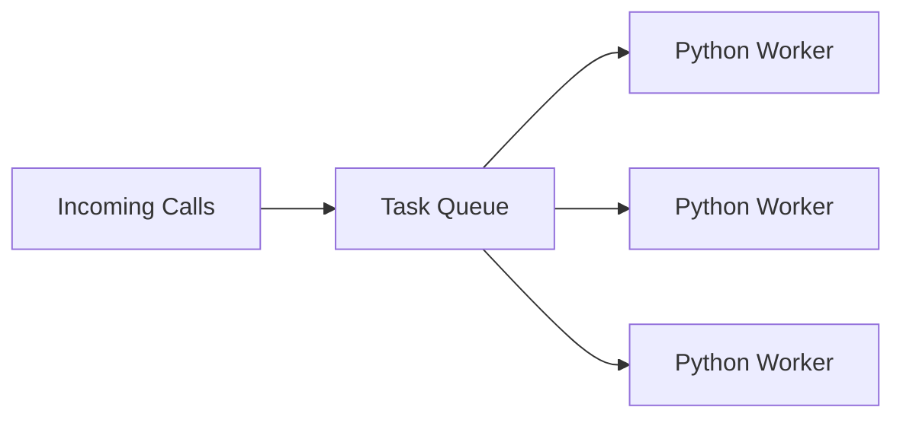
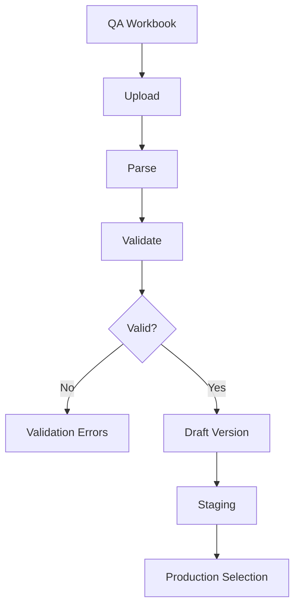
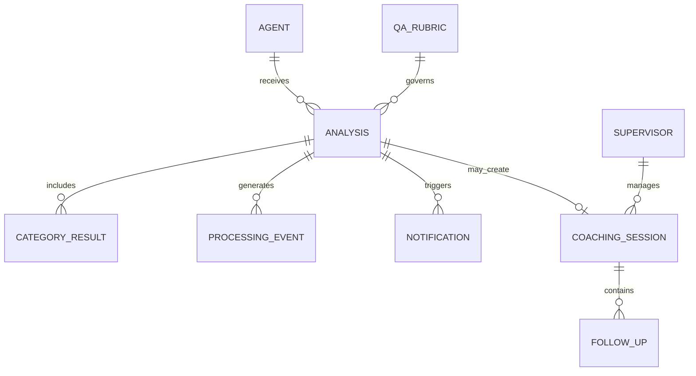
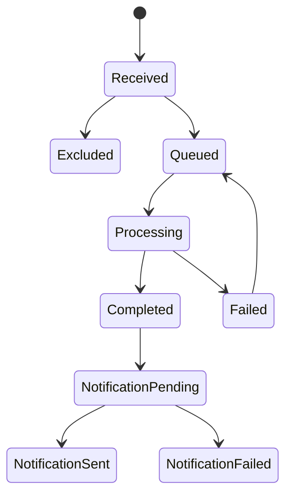
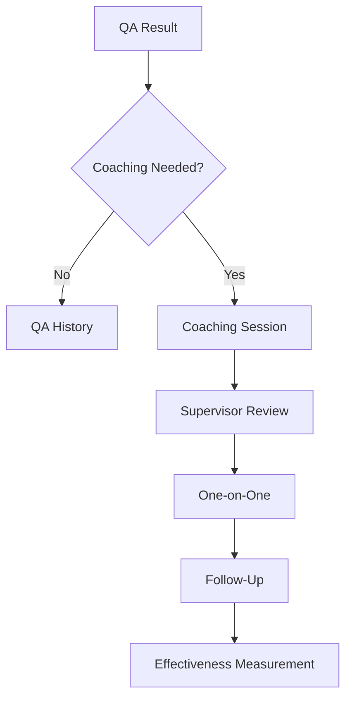
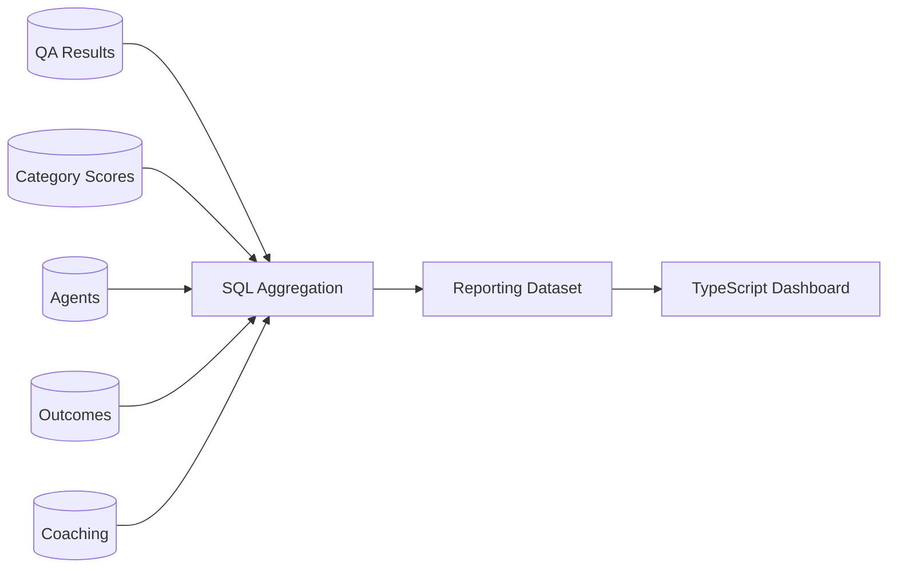
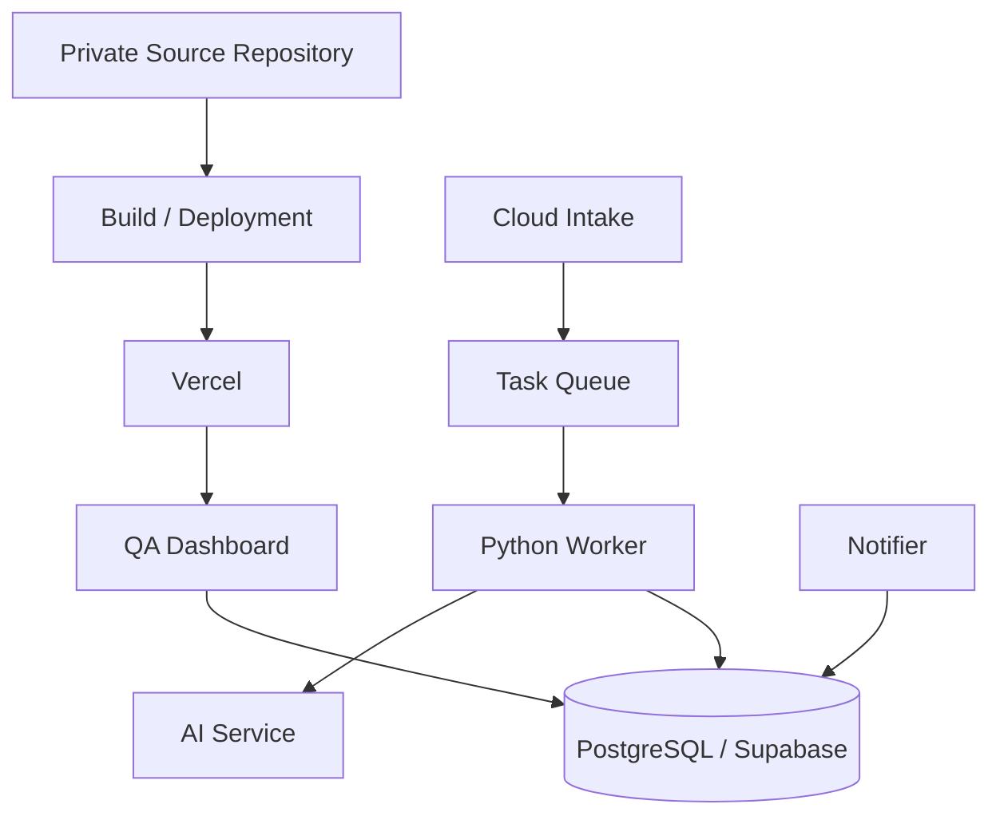
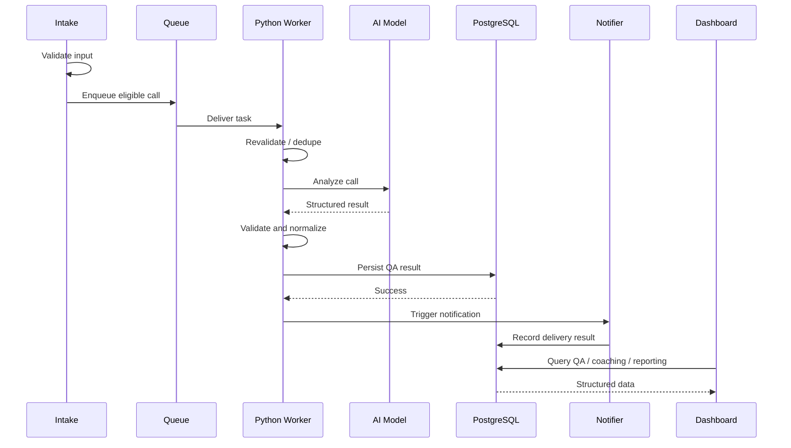

# AI Call Quality & Coaching Platform — Technical Overview

## Introduction

The AI Call Quality & Coaching Platform is a production system that converts completed customer service calls into structured QA evaluations, coaching workflows, operational follow-up signals, and management analytics.

The system combines Python background processing, TypeScript application code, PostgreSQL, Supabase, cloud queues, AI/LLM analysis, automated notifications, and production monitoring.

This document focuses on implementation patterns and engineering decisions. Production credentials, private endpoints, proprietary prompts, exact database schemas, and company-specific QA rules are intentionally excluded.

---

## 1. Technology Stack

| Layer | Technology | Responsibility |
|---|---|---|
| Front End | TypeScript / JavaScript | Dashboards, coaching workflows, filters, administration |
| Styling | HTML / CSS | Application layout and responsive interfaces |
| Processing Services | Python | Intake, analysis, transformation, validation, worker logic |
| Database | PostgreSQL | QA results, coaching, workflow state, reporting data |
| Database Logic | SQL / PL/pgSQL | Aggregation, controlled writes, workflow logic |
| Backend Platform | Supabase | Managed PostgreSQL and supporting application services |
| Hosting | Vercel | User-facing dashboard deployment |
| Cloud Processing | Managed cloud services | Intake, queues, workers, storage, scheduled workloads |
| AI Layer | LLM-based analysis | Structured QA evaluation and coaching signals |
| Integration Layer | REST APIs | Notifications and supporting services |

---

## 2. Core Engineering Model

The platform treats each call as an asynchronous workload rather than a synchronous dashboard request.

```text
Call Recording
     ↓
Intake Validation
     ↓
Processing Queue
     ↓
Python Worker
     ↓
AI Evaluation
     ↓
Structured Validation
     ↓
PostgreSQL
     ↓
Coaching / Reporting / Notifications
```

This design keeps long-running AI work away from the interactive dashboard and allows processing to continue independently.

---

## 3. Service Separation

The application separates major responsibilities into distinct services or logical components.

```text
Intake Service
    ↓
Analysis Queue
    ↓
Analyzer Worker
    ↓
Database
    ↓
Notifier
```

This separation provides several benefits:

- AI processing does not block the dashboard
- Notification failures do not invalidate QA results
- Worker capacity can scale independently
- Failures can be retried without repeating unrelated work
- Processing health can be monitored separately from user-facing traffic

---

## 4. Intake Processing

The intake layer decides whether an incoming recording should enter the QA pipeline.

Typical responsibilities include:

- Receiving recording metadata
- Verifying required fields
- Resolving the associated representative
- Checking eligibility
- Detecting obvious duplicates
- Recording intake state
- Submitting eligible calls to the processing queue

The intake service remains lightweight and does not perform the full AI analysis.

---

## 5. Eligibility Checks

Not every recording should become a QA record.

Conceptually:

```text
Recording exists
        +
Required metadata exists
        +
Representative is eligible
        +
Input is not duplicate
        +
Input belongs in QA population
        =
Eligible for processing
```

Excluded inputs are tracked so administrators can distinguish between received, analyzed, excluded, duplicate, and failed work.

---

## 6. Queue-Based Workloads

A task queue buffers incoming calls between intake and analysis.



The queue provides:

- Backpressure
- Controlled concurrency
- Retry support
- Workload buffering
- Isolation between intake and analysis

---

## 7. Worker Concurrency

AI workloads can be expensive and long-running.

Worker concurrency must therefore be controlled. Too little concurrency creates backlog; too much can create rate limits, database pressure, provider throttling, and unnecessary cloud cost.

The worker design balances throughput against reliability.

---

## 8. Python Analysis Worker

A typical worker task conceptually performs:

```text
1. Receive task
2. Resolve call metadata
3. Retrieve source recording
4. Re-check eligibility and duplication
5. Build analysis context
6. Submit call for AI evaluation
7. Receive structured result
8. Validate result
9. Normalize values
10. Persist QA data
11. Record processing state
12. Trigger downstream notification workflow
```

The exact production implementation is private.

---

## 9. Defensive Revalidation

Important conditions can be checked again at worker execution time.

Examples include:

- Representative still eligible
- Analysis does not already exist
- Required metadata still present
- Recording reference still valid
- Task has not already completed

This protects against stale or duplicate tasks.

---

## 10. Structured AI Output

The AI layer returns structured data rather than only free-form prose.

A conceptual result might include:

```json
{
  "overall_score": 87,
  "call_type": "technical_support",
  "outcome": "resolved",
  "follow_up_required": false,
  "categories": {
    "opening": 4.5,
    "listening": 4.3,
    "empathy": 4.7,
    "accuracy": 4.4
  },
  "strengths": [],
  "opportunities": [],
  "coaching_focus": [],
  "summary": ""
}
```

This is an illustrative public example, not the production schema.

Structured output makes it possible to build filtering, reporting, coaching logic, category comparisons, and workflow automation.

---

## 11. AI Output Validation

AI-generated output is validated before becoming authoritative application data.

Validation can include:

- Required fields are present
- JSON is parseable
- Scores are numeric
- Scores fall within allowed ranges
- Category names are recognized
- Outcomes match known values
- Call types are supported
- Required narrative sections exist

Invalid output can be retried or routed into an error workflow rather than silently stored.

---

## 12. Normalization

AI output can be semantically correct but inconsistent in formatting.

For example:

```text
Technical Support
technical support
TECH_SUPPORT
```

may need to become one canonical value.

Normalization keeps reporting clean and prevents small label differences from fragmenting metrics.

---

## 13. QA Rubric Versioning

The QA standard is treated as versioned configuration rather than hard-coded application text.

A conceptual rubric version contains:

```text
Rubric Version
├── Metadata
├── Categories
├── Weights
├── Rules
└── Environment State
```

Calls can remain associated with the rubric version active when they were analyzed, preserving historical context when standards change.

---

## 14. Rubric Import Workflow

The platform supports validating and importing new QA standards before production use.



This allows QA standards to evolve without immediately changing live scoring.

---

## 15. Staging and Production

Staging is used for testing changes before they affect live QA.

Examples include:

- Rubric updates
- Prompt changes
- Worker changes
- New dashboard logic
- Reporting changes
- Test-call evaluation

This separation is particularly important for AI systems because small prompt or rubric changes can materially alter results.

---

## 16. PostgreSQL Data Layer

PostgreSQL serves as the structured system of record.

Major data domains include:

- Representatives
- Calls
- Analysis results
- Category scores
- Review state
- Coaching state
- Notification state
- Processing state
- Coaching sessions
- Follow-ups
- Rubric versions
- Reporting data

The relational model preserves the connections among calls, people, coaching, and reporting.

---

## 17. Conceptual Data Model



The production schema contains additional implementation details that are intentionally omitted.

---

## 18. SQL and PL/pgSQL

SQL and PL/pgSQL are used where logic benefits from being close to the data.

Examples include:

- Controlled workflow transitions
- Reporting aggregation
- Duplicate checks
- Notification eligibility
- Coaching calculations
- Management reporting functions

Keeping appropriate logic server-side improves consistency and reduces unnecessary application round trips.

---

## 19. Transactional Writes

A successful call analysis may require multiple related database writes.

Conceptually:

```text
BEGIN

Create analysis record
Insert category results
Record rubric version
Record processing completion
Set workflow state

COMMIT
```

If a required step fails, the transaction can roll back rather than leaving a partial analysis.

---

## 20. Duplicate Prevention and Idempotency

Queue-based systems must assume a task may be delivered more than once.

The platform checks existing state before creating another analysis or notification.

Conceptually:

```text
Task arrives
    ↓
Already complete?
   /  Yes  No
 ↓     ↓
Stop  Process
```

This reduces duplicate QA records, duplicate emails, and distorted reporting.

---

## 21. Processing State

Processing state is tracked explicitly.



This makes the background pipeline observable.

---

## 22. Failure Classification

Failures are more useful when categorized.

Examples include:

```text
INVALID_INPUT
INELIGIBLE_AGENT
DUPLICATE_INPUT
STORAGE_FAILURE
ANALYSIS_FAILURE
STRUCTURED_OUTPUT_FAILURE
DATABASE_FAILURE
NOTIFICATION_FAILURE
```

The category helps determine whether the system should retry, exclude, or require administrative review.

---

## 23. Retry Behavior

Transient failures may be retried.

Examples include:

- Temporary network errors
- AI service timeout
- Rate limiting
- Temporary database connectivity
- Email provider interruption

Permanent conditions such as ineligible users, unsupported inputs, or known duplicates should not retry indefinitely.

---

## 24. Processing Health

The Processing Health interface turns background infrastructure state into a usable administrative view.

It can show:

- Inputs received
- Calls analyzed
- Inputs excluded
- Failures
- Attempt counts
- Processing duration
- Notification status
- Detailed workflow outcomes

This means administrators do not need to rely only on raw cloud logs.

---

## 25. Notification Service

Notifications are handled separately from analysis.

```text
Completed QA Result
        ↓
Notification Eligibility
        ↓
Recipient Resolution
        ↓
Message Generation
        ↓
Email Service
        ↓
Delivery Result
        ↓
Status Stored
```

A failed email should not cause a valid QA result to be rolled back.

---

## 26. Duplicate Notification Prevention

Before sending a coaching notification, the notifier can check whether a successful send has already been recorded.

This prevents repeated queue delivery from sending the same coaching email multiple times.

---

## 27. Coaching Workflow

QA data feeds into a persistent human coaching process.



AI supports coaching but does not replace supervisor responsibility.

---

## 28. Coaching Effectiveness

The platform can compare scored calls before and after a documented coaching event.

```text
Pre-Coaching Calls
        ↓
Baseline
        ↓
Coaching Session
        ↓
Post-Coaching Calls
        ↓
Comparison
```

The platform can evaluate overall score change, category-level change, improvement, stability, decline, and follow-up requirements.

The exact production thresholds are private.

---

## 29. Management Analytics

Management reporting transforms large numbers of individual analyses into organization-level signals.

Examples include:

- Average QA score
- Call volume
- Standards attainment
- Category performance
- Outcome mix
- Follow-up rate
- Review completion
- Representative comparison
- Call-type performance
- Coaching impact

---

## 30. Reporting Architecture



Centralizing metric logic reduces the risk of different screens calculating the same KPI differently.

---

## 31. Role-Based Application

The TypeScript dashboard exposes different tools based on responsibility.

```text
Representative
    → Personal QA and coaching

Supervisor
    → Team review and coaching

Management
    → Analytics and trends

Administrator
    → Processing health and configuration
```

Authorization is enforced server-side rather than relying only on hidden UI elements.

---

## 32. Workflow State Separation

The platform tracks multiple state dimensions separately:

```text
Processing State
Review State
Coaching State
Notification State
```

A call can be complete in one workflow while still pending in another.

This makes operational troubleshooting far clearer.

---

## 33. Human-in-the-Loop Design

The AI component can analyze, score, classify, summarize, and recommend.

Supervisors can review, interpret context, coach, document, and follow up.

The platform is designed as AI-assisted management tooling rather than a fully autonomous decision system.

---

## 34. Operational Intelligence

The system also extracts information beyond QA score.

Structured calls can surface:

- Common issue types
- Resolution patterns
- Unresolved interactions
- Follow-up demand
- Callback needs
- Process friction

This makes the system useful for operational intelligence as well as employee coaching.

---

## 35. Testing Strategy

Testing focuses on critical business behavior.

Important areas include:

- Intake eligibility
- Duplicate prevention
- Queue processing
- AI output parsing
- Score validation
- Database persistence
- Notification eligibility
- Coaching transitions
- Reporting calculations
- Access control

---

## 36. Worker and Integration Tests

Worker tests can simulate:

```text
Valid call
Invalid metadata
Ineligible representative
Duplicate task
Model timeout
Invalid structured output
Database failure
Retry behavior
```

Integration tests verify complete component chains such as:

```text
Input
→ Worker
→ Structured Result
→ Database
```

and:

```text
Completed QA
→ Notifier
→ Delivery State
```

---

## 37. Reporting Validation

A dashboard can render correctly while displaying the wrong number.

Reporting validation therefore checks:

- Call counts
- Date filters
- Score averages
- Category averages
- Outcome totals
- Team scoping
- Review status
- Coaching counts

Metric correctness is treated separately from visual correctness.

---

## 38. Performance

The system has two different performance profiles.

### Background Processing

Optimized for queue throughput, AI latency, worker reliability, and retry management.

### Dashboard

Optimized for query speed, filtering, aggregation, and responsive rendering.

Separating these workloads allows each to scale independently.

---

## 39. Deployment

The user-facing application is deployed through Vercel while background processing runs independently.



The public showcase repository is separate from the production repository.

---

## 40. Environment Configuration and Secrets

Sensitive configuration remains outside public source code.

Examples include:

- Database credentials
- API keys
- Model credentials
- Notification credentials
- Private service URLs
- Cloud service configuration

Environment variables and deployment configuration provide these values to the appropriate services.

---

## 41. Database Migrations

Database changes are managed through versioned migrations rather than undocumented manual production edits.

Migration-based changes improve repeatability, reviewability, deployment safety, historical traceability, and rollback planning.

---

## 42. Source Control and CI

Production development benefits from:

- Feature branches
- Pull requests
- Code review
- Automated tests
- Dependency management
- Ownership rules
- Controlled deployment

These practices are part of maintaining a production application, not merely organizing code.

---

## 43. Observability

Useful signals include:

- Queue throughput
- Processing duration
- Failure rate
- Exclusion rate
- Retry attempts
- Notification success
- Analysis completion

The platform combines cloud logs with application-level operational views so administrators can understand both technical and business state.

---

## 44. Security and Privacy

The platform processes employee performance information and customer interactions.

Public documentation therefore excludes:

- Raw recordings
- Customer transcripts
- Employee email addresses
- Customer identifiers
- Private file identifiers
- Authentication secrets
- Private service URLs
- Proprietary prompts
- Exact scoring rules

Screenshots used in the public showcase have sensitive information obscured.

---

## 45. Data Minimization

Each component receives only the data required for its responsibility.

Examples:

```text
Management dashboard
→ Structured QA data
→ No raw audio required

Notifier
→ Recipient + coaching content
→ No full reporting dataset required

Representative portal
→ Authorized personal data
→ No administration data required
```

This reduces unnecessary exposure and coupling.

---

## 46. Technical Challenges Solved

### High-Volume Background Processing
**Problem:** Calls can arrive faster than AI analysis completes.  
**Solution:** Queue-based asynchronous workers.

### Duplicate Task Delivery
**Problem:** Cloud task systems can retry work.  
**Solution:** Idempotent processing and duplicate checks.

### AI Output Variability
**Problem:** Model output can vary.  
**Solution:** Structured schemas, validation, and normalization.

### Notification Failure
**Problem:** Email can fail after analysis succeeds.  
**Solution:** Separate analysis and notification state.

### Evolving QA Standards
**Problem:** Scoring rules change over time.  
**Solution:** Versioned rubric configuration.

### Coaching Accountability
**Problem:** Feedback can disappear after one conversation.  
**Solution:** Persistent coaching sessions and follow-up state.

### Management Visibility
**Problem:** Thousands of analyses are difficult to interpret manually.  
**Solution:** SQL-driven aggregation and analytics.

### Production Troubleshooting
**Problem:** Background failures are difficult to see.  
**Solution:** Processing state, attempts, failure categories, and health dashboards.

---

## 47. Maintainability

Major concerns can evolve independently.

Examples:

- Dashboard UI can change without rewriting worker logic
- Notification logic can change without rewriting analysis
- Rubrics can change without rebuilding the dashboard
- Reporting can expand without changing call intake
- Worker capacity can scale without changing the web application

This separation reduces the impact of future changes.

---

## 48. Technical Ownership

The project spans multiple disciplines:

- Python backend services
- TypeScript application development
- PostgreSQL data modeling
- SQL / PL/pgSQL
- AI integration
- Queue-based architecture
- Cloud infrastructure
- REST APIs
- Authentication and authorization
- Reporting
- Coaching workflows
- Testing
- Deployment
- Production troubleshooting

The system is therefore much broader than a single AI prompt or dashboard.

---

## End-to-End Processing Example



---

## Public Portfolio Scope

This technical overview intentionally demonstrates engineering depth while protecting the production environment.

Included:

- Processing-service architecture
- Queue patterns
- Worker behavior
- Structured AI design
- Database patterns
- Coaching workflows
- Notification architecture
- Reporting strategy
- Testing approach
- Reliability patterns
- Security principles
- Production engineering practices

Excluded:

- Production API keys
- Exact cloud resource names
- Private URLs
- Service-account information
- Raw recordings
- Customer transcripts
- Employee identifiers
- Exact schema definitions
- Proprietary prompts
- Internal scoring rules
- Environment secrets

---

## Summary

The AI Call Quality & Coaching Platform is not simply an AI call summarizer.

It combines:

```text
Call Intake
    +
Cloud Storage
    +
Task Queues
    +
Python Processing
    +
AI Evaluation
    +
Structured Data
    +
PostgreSQL
    +
Notifications
    +
Coaching
    +
Management Analytics
    =
AI Call Quality & Coaching Platform
```

The technical design focuses on reliability, structured AI output, asynchronous processing, duplicate prevention, failure isolation, workflow traceability, role-based access, measurable coaching, scalable reporting, and production observability.
